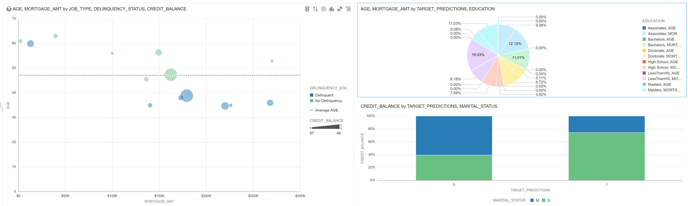
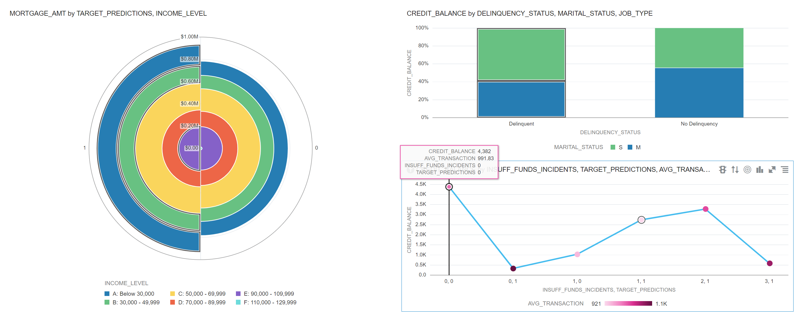
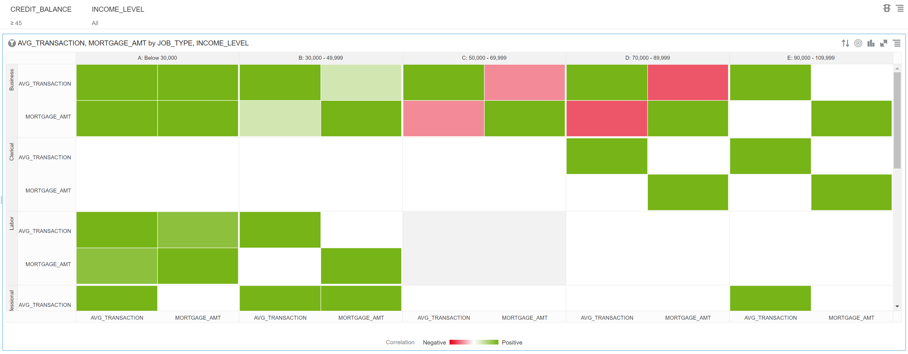

# Explaining How Models Work using `ADSExplainer`

## Introduction

You will learn how to explain models using 'ADSExplainer'

### Objectives

In this lab, you will:
* Using 'ADSExplainer'
* Using Model Catalog to Push to Production
* Use Trained LGBM Model to Predict on New Data
* Sending Results to ADW to be used with OAC
* Using Oracle Analytics Cloud

### Prerequisites

This lab assumes you have:
* An Oracle account
* All previous labs successfully completed

## Using 'ADSExplainer'

```python
# our model explainer class
explainer = ADSExplainer(test, model)

# let's created a global explainer
global_explainer = explainer.global_explanation(provider=MLXGlobalExplainer())

global_explainer.feature_importance_summary()
```

```python
importances = global_explainer.compute_feature_importance()
importances.show_in_notebook(n_features=10)
```
## Using Model Catalog to Push to Production

```python
# prepare the model artifact template
import tempfile
from os import path
from ads.common.model_export_util import prepare_generic_model
from ads.catalog.model import ModelSummaryList, ModelCatalog
from ads.catalog.project import ProjectSummaryList, ProjectCatalog
from ads.catalog.summary import SummaryList
from ads.common.model_artifact import ModelArtifact

path_to_generic_model_artifact = "/home/datascience/Retail"

path_to_generic_model_artifact = tempfile.mkdtemp()
generic_model_artifact = prepare_generic_model(path_to_generic_model_artifact, force_overwrite=True, data_science_env=True)

# Serialize the model
import cloudpickle
with open(path.join(path_to_generic_model_artifact, "model.pkl"), "wb") as outfile:
    cloudpickle.dump(model, outfile)

# List the template files
print("Model Artifact Path: {}\n\nModel Artifact Files:".format(path_to_generic_model_artifact))
for file in os.listdir(path_to_generic_model_artifact):
    if path.isdir(path.join(path_to_generic_model_artifact, file)):
        for file2 in os.listdir(path.join(path_to_generic_model_artifact, file)):
            print(path.join(file,file2))
    else:
        print(file)
```

```python
with open(path.join(path_to_generic_model_artifact, "score.py"), 'r') as f:
    print(f.read())
```

## Use Trained LGBM Model to Predict on New Data

```python
with open(path.join(path_to_generic_model_artifact, "requirements.txt"), 'r') as f:
    print(f.read())
```

## Sending Results to ADW to be used with OAC

```python
generic_model_artifact.reload(model_file_name='model.pkl')
predictions = generic_model_artifact.model.predict(test.X)

test.X['target_predictions'] = predictions
test_original.X['target_predictions'] = predictions
```

```python
from sqlalchemy import create_engine

engine = create_engine(uri)

test_original.X.to_sql('customers_predictions', engine, if_exists='replace')
```

```python
pd.read_sql("select * from customers_predictions", con=engine).head()
```

### Now that results have been pushed to ADW, we can further analyze using Oracle Analytics Cloud

Signin to Oracle Cloud and go to your analytics instance. If you dont have an analytics instance running, please go to this [link] (https://docs.oracle.com/en/learn/set_up_data_warehouse/provisioning-oac/provisioning-oac.html#introduction)

Then make a connection to the ADW. If you need additional instructions, follow this [link] (https://docs.oracle.com/en/learn/set_up_data_warehouse/oac/oac.html#task-1-create-the-connection-from-oracle-analytics-cloud-to-autonomous-database)

Lastly, you are able to begin making visualization and gathering further insights on your data that can then be shared and presented. Here are some examples:








### Overview

Feature permutation importance is a model-agnostic global explanation method that provides insights into a machine learning model's behavior. It estimates and ranks feature importance based on the impact each feature has on the trained machine learning model's predictions.

### Description

Feature permutation importance measures feature importance for any black-box estimator, classifier or regressor, by evaluating how the prediction error increases when a feature is not available. Any scoring metric can be used to measure the prediction error (e.g. F1 for classification and R2 for regression). To avoid actually removing features and hence retraining the estimator, for each feature, the algorithm randomly shuffles the feature values, effectively adding noise to the feature. Then, the prediction error of the new dataset is compared with the prediction error of the original dataset. If the model heavily relies on the column being shuffled to accurately predict the target variable (an important feature), this random re-ordering will cause less accurate predictions. If the model does not rely on the feature for its predictions (an unimportant feature), the prediction error remains unchanged.

#### Supported metrics:

Classification: accuracy, roc_auc, balanced_accuracy, f1_macro, f1_micro, f1_weighted [default], precision_macro, precision_micro, precision_weighted, recall_macro, recall_micro, recall_weighted
Regression: r2 [default], neg_mean_squared_error, neg_root_mean_squared_error, neg_mean_absolute_error, neg_median_absolute_error, neg_mean_absolute_percentage_error, neg_symmetric_mean_absolute_percentage_error

#### The following summarizes the main steps in computing feature permutation importance explanations:

Start with a trained machine learning model to explain.
Calculate the baseline prediction error on the given dataset (e.g., train dataset or test dataset).
For each feature:
Randomly shuffle the feature column in the given dataset.
Calculate the prediction error on the shuffled dataset.
Store the difference between the baseline score and the shuffled dataset score as the feature importance (i.e., baseline_score - shuffled_score).
Repeat steps 1-3 multiple times and report the average to mitigate the effects of random shuffling.
Rank the features based on the average impact each feature has on the model's score. Features that have a larger impact on the score when shuffled are assigned higher importance than features with little-to-no impact on the model's score.
Note that in some cases, randomly permuting an unimportant feature can actually have a positive effect on the model's prediction. In such cases, the feature's contribution towards the model's predictions is effectively noise. In the feature permutation importance visualizations, MLX caps any negative feature importance values at zero.

### Interpretation

Feature permutation importance explanations generate an ordered list of features along with their importance values. Interpreting the output of this algorithm is straightforward. Features located at higher ranks have more impact on the model predictions, features at lower ranks have less impact on the model predictions. Additionally, the importance values represent the relative importance of features.

#### The output supports two types of visualizations:

Horizontal bar chart ('bar'): The bar chart shows the model's view of the relative feature importance. The x-axis highlights feature importance. A longer bar indicates higher importance than a shorter bar. Each bar also shows the average feature importance value along with the standard deviation of importance values across all iterations of the algorithm (< mean_importance > +/- < standard_deviation >). As described above, negative importance values are capped at zero. The y-axis shows the different features in the relative importance order (top being the most important, bottom being the least important).
Detailed scatter plot ('detailed'): The detailed bar chart shows the feature importance values for each iteration of the algorithm. These values are used to compute the average feature importance values and the corresponding standard deviations shown in the bar chart. The x-axis shows the impact that permuting a given feature had on the model's prediction score. The y-axis shows the different features in the relative importance order (top being the most important, bottom being the least important). The color of each dot in the graph indicates the quality of the permutation for this iteration, which is computed by measuring the correlation of the permuted feature column relative to the original feature column (i.e., how different is the permuted feature column versus the original feature column).
Detailed box plot ('box_plot'): The detailed box plot shows the feature importance values across the iterations of the algorithm. These values are used to compute the average feature importance values and the corresponding standard deviations shown in the bar chart. The x-axis shows the impact that permuting a given feature had on the model's prediction score. The y-axis shows the different features in the relative importance order (top being the most important, bottom being the least important). The minimum, first quartile, median, third quartile, and maximum of the feature importance values across different iterations of the algorithm are shown by each box.

## Learn More

### OCI Data Science - Useful Tips
<details>
<summary><font size="3">Check for Public Internet Access</font></summary>

```python
import requests
response = requests.get("https://oracle.com")
assert response.status_code==200, "Internet connection failed"
```
</details>
<details>
<summary><font size="3">Helpful Documentation </font></summary>
<ul><li><a href="https://docs.cloud.oracle.com/en-us/iaas/data-science/using/data-science.htm">Data Science Service Documentation</a></li>
<li><a href="https://docs.cloud.oracle.com/iaas/tools/ads-sdk/latest/index.html">ADS documentation</a></li>
</ul>
</details>
<details>
<summary><font size="3">Typical Cell Imports and Settings for ADS</font></summary>

```python
%load_ext autoreload
%autoreload 2
%matplotlib inline

import warnings
warnings.filterwarnings('ignore')

import logging
logging.basicConfig(format='%(levelname)s:%(message)s', level=logging.ERROR)

import ads
from ads.dataset.factory import DatasetFactory
from ads.automl.provider import OracleAutoMLProvider
from ads.automl.driver import AutoML
from ads.evaluations.evaluator import ADSEvaluator
from ads.common.data import ADSData
from ads.explanations.explainer import ADSExplainer
from ads.explanations.mlx_global_explainer import MLXGlobalExplainer
from ads.explanations.mlx_local_explainer import MLXLocalExplainer
from ads.catalog.model import ModelCatalog
from ads.common.model_artifact import ModelArtifact
```
</details>
<details>
<summary><font size="3">Useful Environment Variables</font></summary>

```python
import os
print(os.environ["NB_SESSION_COMPARTMENT_OCID"])
print(os.environ["PROJECT_OCID"])
print(os.environ["USER_OCID"])
print(os.environ["TENANCY_OCID"])
print(os.environ["NB_REGION"])
```
</details>

## Acknowledgements
* **Author** - Jeremy Mendez, Senior Cloud Engineer
* **Contributors** - Aaron Whitman, Associate Cloud Engineer 
* **Last Updated Date** - October, 2021