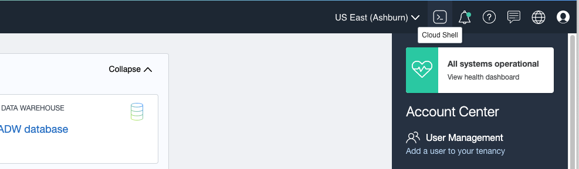
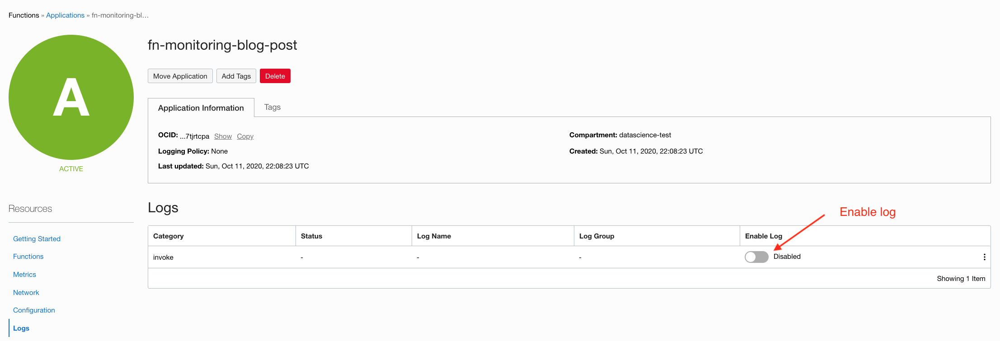
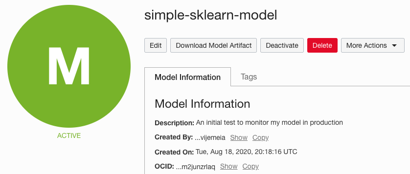

# Deploying the model as an Oracle Function through Oracle Cloud Infrastructure Cloud Shell

## Introduction

We’ve completed the model training steps and saved an artifact to the model catalog. Next, take the model artifact that you saved, build an Oracle Function Docker image, push that image to the Oracle Registry, and deploy it as an Oracle function. 

### Objectives

In this lab, you will:
* Create an Oracle Function Application Through OCI Cloud Shell

## Task 1: Access Oracle Cloud Shell Service and Download the Model Artifact

Fortunately, we can accomplish all these steps using the [Cloud Shell service](https://docs.cloud.oracle.com/en-us/iaas/Content/API/Concepts/cloudshellintro.htm), available in the OCI Console. In principle, you can do all that work from your laptop, but Cloud Shell is easy to use and comes preconfigured with your own OCI credentials, Docker, and the Function CLI (fn). 

To access Cloud Shell, go to the Console home page and click the Cloud Shell icon in the top menu bar. 

  

Once you have a Cloud Shell window running, download the model artifact you created by downloading and unzipping the artifact file using these two shell commands. Replace with your model OCID value. You can find the model OCID value in the model details page.

  

```python
% oci data-science model get-artifact-content --model-id <your-model-ocid> --file test.zip
% unzip test.zip 
```

Create an Oracle Function application to host your machine learning model function. Go to the Console and, under Developer services, select Functions. Then select Create Application. 

After creating your application, ensure that your application has logs enabled. Under the Resources menu, go to Logs. Select a [log group, log name, and retention period](https://docs.cloud.oracle.com/en-us/iaas/Content/Logging/Task/managinglogs.htm) for your logs. 

  

Once you’ve created an application, I recommend that you go through Getting Started in the Resources menu of your application. The guide walks you through the necessary steps to configure the fn CLI in your Cloud Shell environment and Docker. 

Once you’ve completed the Getting Started guide, you can deploy your function. Change the value <your-app-name> to the name of the application you previously created. 

```python
fn --verbose deploy --app <your-app-name>
```

You should see a successful Docker image build in Cloud Shell. The image is stored in the Registry, and you can find your new function in your application in the Console. 

## Learn More

* [Blog Post- Deploying a Machine Learning Model with Oracle Functions](https://blogs.oracle.com/ai-and-datascience/post/deploying-a-machine-learning-model-with-oracle-functions)
* [Other Related Blog Posts](https://blogs.oracle.com/ai-and-datascience/authors/Blog-Author/COREA7667DA212B34765B4DB91B94737F00E/jean-rene-gauthier)

## Acknowledgements
* **Author** - Jean-Rene Gauthier, Sr Principal Product Data Scientist
* **Contributors** -  Samuel Cacela, Cloud Engineer & Aaron Whitman, Cloud Engineer